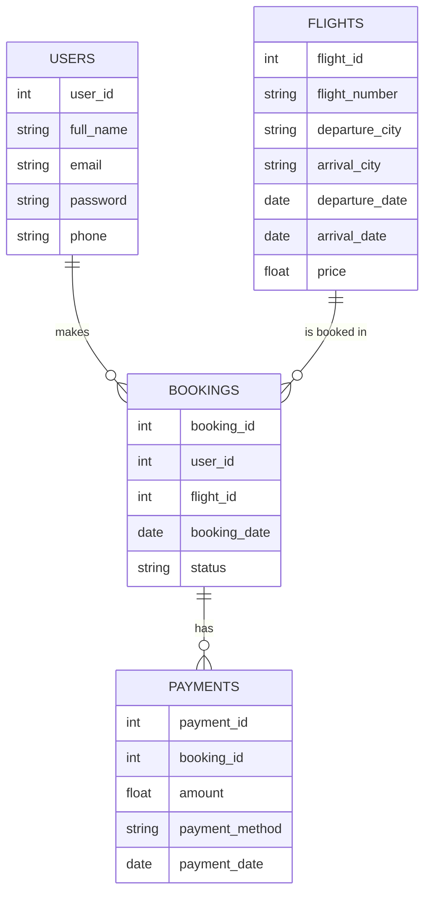

# AirBooking

## ER Diagram — AirBooking System

```mermaid
erDiagram
    USERS {
        int user_id
        string full_name
        string email
        string password
        string phone
    }

    FLIGHTS {
        int flight_id
        string flight_number
        string departure_city
        string arrival_city
        date departure_date
        date arrival_date
        float price
    }

    BOOKINGS {
        int booking_id
        int user_id
        int flight_id
        date booking_date
        string status
    }

    PAYMENTS {
        int payment_id
        int booking_id
        float amount
        string payment_method
        date payment_date
    }

    USERS ||--o{ BOOKINGS : "makes"
    FLIGHTS ||--o{ BOOKINGS : "is booked in"
    BOOKINGS ||--o{ PAYMENTS : "has"
```
